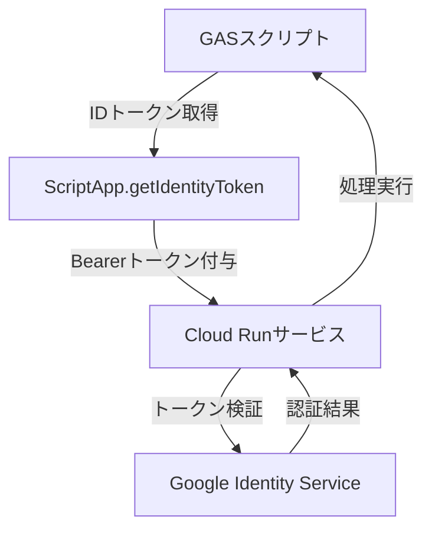

# requestEmbeddings.gs

Google Apps Script (GAS) から Cloud Run サービスを呼び出して埋め込み処理を行うスクリプト

## 機能概要
- スプレッドシートからQAデータ（質問と回答）を読み取り
- JSON形式に変換してCloud Runサービスに送信
- 認証に`ScriptApp.getIdentityToken()`を使用した安全な通信
- 処理結果のログ記録とユーザー通知

## 事前準備

### 1. GCPプロジェクト設定
1. Google Cloud Consoleでプロジェクトを作成
2. Cloud Run APIを有効化
3. OAuth同意画面を設定（外部ユーザータイプを選択）

### 2. スクリプトプロパティ設定
| プロパティ名                   | 説明                                |
|----------------------------|-----------------------------------|
| `QA_SHEET_ID`              | データ取得用スプレッドシートID            |
| `GCF_API_EMBEDDINGS_ENDPOINT` | Cloud RunサービスのエンドポイントURL     |

### 3. 必要な権限設定
```json
{
  "oauthScopes": [
    "https://www.googleapis.com/auth/script.external_request",
    "https://www.googleapis.com/auth/spreadsheets",
    "https://www.googleapis.com/auth/userinfo.email",
    "https://www.googleapis.com/auth/cloud-platform",
    "openid"
  ]
}
```

## インストール手順

### 1. リポジトリのクローン
```bash
git clone https://github.com/KayD0/Linebot.git
cd Linebot
```

### 2. GASプロジェクト設定
1. Apps Scriptダッシュボードで新規プロジェクト作成
2. `appsscript.json`に上記oauthScopesを追加
3. スクリプトプロパティに必要な値を設定

### 3. Cloud Run側の設定
1. サービスアカウントに以下のIAM権限を付与:
   - `roles/run.invoker`
   - `roles/cloudfunctions.invoker`
2. 認証が必要なサービスとしてデプロイ

## 使用方法
1. スプレッドシートにQAデータを入力（A列:質問、B列:回答）
2. スクリプトエディタで`requestLinebotEnbeddings`関数を実行
3. 成功時は登録成功メッセージ、失敗時はエラーログを確認

## 認証フロー


## トラブルシューティング
**401エラーが発生する場合:**
1. Cloud RunサービスのIAM設定を確認
2. トークンの有効性を確認（有効期限30分）
3. コマンドでトークン検証:
```bash
curl -v -H "Authorization: Bearer [TOKEN]" [CLOUD_RUN_URL]
```

## 注意事項
- 初回実行時にOAuth認証が必要
- トークンの有効期限に注意（再実行で更新）
- 機密データを含む場合は追加のセキュリティ対策を推奨
